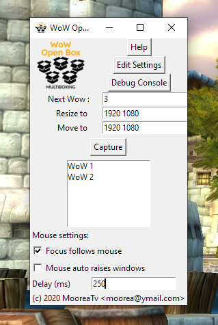

# Wow Open Box online HELP

## Basic information

1. Use the "Window Layout" UI to setup your Windows automatically (and you can now tweak the intelligent auto layouts by dragging any window to reposition it or resize it by dragging the orange bottom right corner) _or_

1. Manually select the Size you want your next window to be(*)

1. Manually select the position you want it to be at(*)

1. Decide if that window should stay on top of others. you can use a hotkey (default `Ctrl-Shit-T`) to toggle that setting on the fly.(*)

1. Use the Bnet launcher to start your wow windows, make them "Fullscreen (Windowed)" so they are border and titlebar less and exact dimension of the windows.

1. Press the "Capture" button or use its hotkey (default `Ctrl-Shift-C`)

1. Press a hotkey to change which window gets the keyboard input: default key are `Ctrl-F1` for Wow 1, `Ctrl-F2` for Wow 2, etc.. or rotate between windows with hotkeys to focus the next window (defaults to `Ctrl-Shift-N`) and previous window (defaults to `Ctrl-Shift-P`). Hotkeys are changeable in settings.

1. Press a hotkey to swap window 1 and window N: default `Ctrl-Shift-F2` will swap 1 and 2,  `Ctrl-Shift-F3` for swapping 1 and 3, etc... changeable in settings (note that it swaps what is currently showing in each position, so if you swap 1-2 (1,2,3->2,1,3) and then 1-3 you end up with 3 1 2). Input on this new feature is welcome. 

*: You can change all settings at any time and they will be saved, per window index when you click "Update" or "Save and Apply" in the Window Layout GUI.

Your settings are saved in `wowopenboxSettings.tcl` in same folder as WowOpenBox and can be edited pressing the "Edit Settings" button.

## Mouse control

You can change the focus following mouse and auto raise/set foreground and the delay

Note that to change the delay you need to hit the Return key

There is a "Track Mouse" (and stop tracking) button (and hotkey, default `Ctrl-Shift-M`) to track coordinates to help doing pixel perfect placement of your windows

You can toggle the focus follow mouse behavior using a hotkey (default `Ctrl-Shift-F`)

## Need more help? Report a problem? Suggest a new feature?

Make sure you are running the latest [release](https://github.com/WowOpenBox/WowOpenBox/releases)

Check if your [issue](https://github.com/WowOpenBox/WowOpenBox/issues/) or suggestion has already been report and if not make a new detailed one

Reach out on [Discord](https://discord.gg/SMGvEeb)
