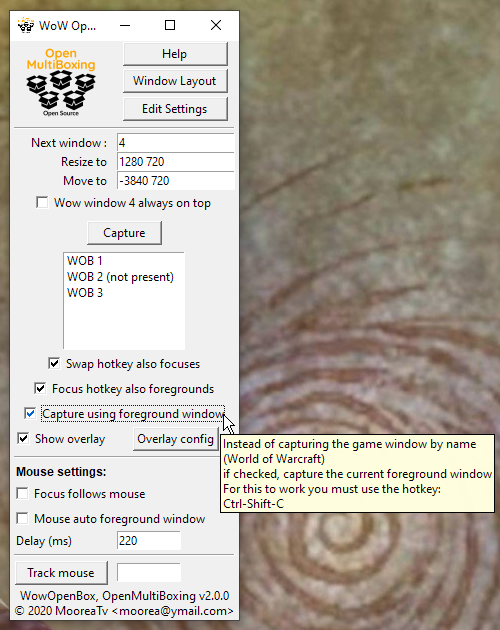
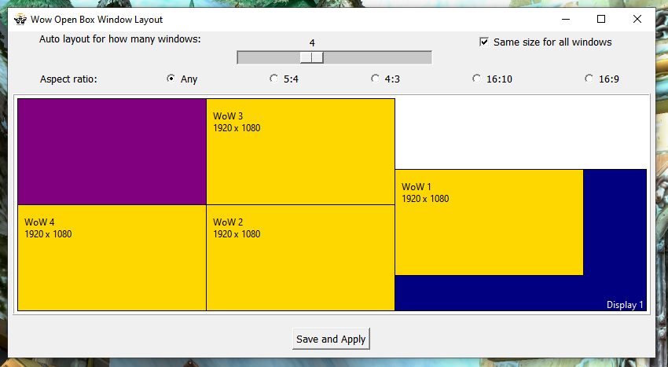

# Wow Open Box (Open Source, compliant, Multiboxing)

Welcome to WowOpenBox.org the hub for truly Open Source and Blizzard rules compliant World of Warcraft MultiBoxing/Dual-Boxing!

We started this effort Mid November 2020 and already have dozens of ever improving feature-full releases and many happy users.

Join the conversation through GitHub, make or help prioritize [issues](https://github.com/WowOpenBox/WowOpenBox/issues/), PRs, or [Discord](https://discord.gg/SMGvEeb)

The first of many functional [release](https://github.com/WowOpenBox/WowOpenBox/releases) was on November 22nd 2020!

Participate and let's make this the best tool for multiboxing (in addition to being the only Open Source one).

See also a [comparison](https://github.com/WowOpenBox/WowOpenBox/wiki/compare) of WowOpenBox and other multiboxing solutions.

See also the [help](help) page.

WowOpenBox (WOB) is optimized to be the safest and best solution for Blizzard's World of Warcraft but can also be use to manage multiple windows of other applications or games.

## Installation

WowOpenBox is optimized for Microsoft Windows 10.

Since release 2.2, WOB/OMB is entirely built automatically from source by GitHub actions CI (continuous integration).

Simply download the all in one binary from the latest release at: [https://github.com/WowOpenBox/WowOpenBox/releases](https://github.com/WowOpenBox/WowOpenBox/releases)

Run it and enjoy!

(Please report any problem!)

Window Layout wizard:

Optional/toggle-able overlay information indicating which window has focus:

